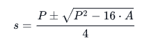

# Problem 1 Statement
We provide the implementation for a Rectangle class in the editor. Perform the following tasks:

Add an area method to Rectangle's prototype.
Create a Square class that satisfies the following:
* It is a subclass of Rectangle.
* It contains a constructor and no other methods.
* It can use the Rectangle class' area method to print the area of a Square object.

Locked code in the editor tests the class and method implementations and prints the area values to STDOUT.

============================================================================================

# Problem 2 Statement

The code in the editor has a tagged template literal that passes the area and perimeter of a rectangle to a tag function named sides. Recall that the first argument of a tag function is an array of string literals from the template, and the subsequent values are the template's respective expression values.

Complete the function in the editor so that it does the following:



1. Finds the initial values of `s1` and `s2` by plugging the area and perimeter values into the formula:
where `A` is the rectangle's area and `P is its perimeter.
2. Creates an array consisting of `s1` and `s2` and sorts it in ascending order.
3. Returns the sorted array.
### Input Format

* The first line contains an integer denoting `s1`.
* The second line contains an integer denoting `s2`.

### Output Format

Return an array consisting of `s1` and `s2`, sorted in ascending order.

### Sample Input 0
```
10
14
```
### Sample Output 0
```
10
14
```